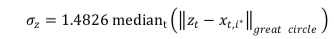
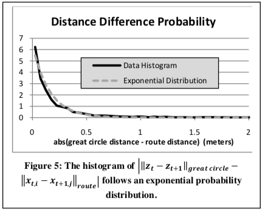
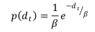

# Offline-MapMatching
A <a href="https://github.com/qgis/QGIS">QGIS</a>-plugin for matching a trajectory with a network using a Hidden Markov Model and Viterbi algorithm.

## Goal of the project
Matching a trajectory with a network, e.g. a road network, is a classical task in geoinformatics.
It can be differentiated into online, i.e. during the measurement of the trajectory like in car navigation,
and offline, i.e. after the measurement of the trajectory, map matching. This plugin addresses only the offline map mathing.
<br>
Because of inaccuracies of the GNSS signal and/or a low data quality of the network, the positions of the trajectory
and the network are differing. In many cases a simple snapping of the trajectory on the network will not work. Reasons for that
can be e.g. outliers in the trajectory or crossings of edges in the network.
<br>
This plugin provides a statistical approach to solve the problem of offline map matching using the principles of 
Hidden Markov Models (HMM) and the Viterbi algorithm.

## Installation


## Usage
- just fill in all entries in the plugin and click the start button
- the tool provides an explanation for each entry directly in the dialog
- the plugin will not run correctly, if at least one entry is not filled
- during the processing the dialog will be deactived until the processing finished
- information about the current processing step will be written to the QGIS-log and displayed above the progressbar
- further information, e.g. detailed information about the algorithm, can be found under the next captions
- the plugin can be started via the toolbox too
- the plugin can be started via the processing framework directly in python too
- example for the python command:
```python
processing.run('omm:match_trajectory', {'NETWORK': 'network_layer',
                                        'TRAJECTORY': 'trajectory_layer',
                                        'TRAJECTORY_ID': 'id',
                                        'CRS': '25833',
                                        'SIGMA': 50.0,
                                        'MY': 0.0,
                                        'BETA': 30.0,
                                        'MAX_SEARCH_DISTANCE': 20.0,
                                        'OUTPUT': 'destination_in_filesystem'})
```
- the processing plugin returns a python dictionary, e.g.:
```python
{'OUTPUT': 'destination_in_filesystem',
'ERROR_CODE': 0,
'COMPUTATION_TIME': 123.45}
```
- the ERROR_CODE will be a negative number if an error occured during processing, otherwise it is equal 0
- the processing plugin writes all messages, also errors, to the QGIS-log (like the GUI-plugin)

## Hints for usage
- the progress of the computation will be displayed with a progressbar (starts from zero for every computation step)
and written to the QGIS-log
- it is recommended to set the maximum search distance as low as possible, because this setting has a very huge influence on the computation time
- it is recommended to use a low segmented network layer, because candidate points will be searched for
every linestring, i.e. the more linestrings can be found in the maximum search distance, the more candidates will be found
and the more computation time is needed
- use a metric CRS, because distances will be calculated
- the quality of the trajectory is very important for a good result, i.e. big outliers should be removed before running the plugin
(the algorithm does not know, which observation is an outlier, and searches the most likely path for the whole trajectory)
- the distance between two following points of the trajectory should be 100m or less for better results
- if positions where measured time-controlled, standing times should be removed before running the plugin
- multi-geometries are not supported, i.e. layers with this geometry type will not be displayed in the comboboxes

## Hints for developement
- the plugin was created using the QGIS-plugin "plugin builder"
- additional python files related to the Hidden Markov Model and the Viterbi algorithm can be found in the
<a href="https://github.com/jagodki/Offline-MapMatching/tree/master/src/offlinemapmatching/mm">mm</a>-folder
- additional python files related to processing framework can be found in the 
<a href="https://github.com/jagodki/Offline-MapMatching/tree/master/src/offlinemapmatching/mm_processing">mm_processing</a>-folder

## Description of the computation
First, the plugin calculates possible candidate points for each point of the trajectory (observations) (Budig 2012: 10).
The candidates will be arranged in a candidate graph with n layers, n = count of observation points (Budig 2012: 13).
After calculating different posibilities, the path with the highest posibility will be found using the Viterbi algorithm.
Below the different parts of the computation in a nutshell, followed by explicit descriptions of each step:
- read the input layers
- calculate candidate points for each trajectory point using the maximum search distance and store them in a graph
- calculate the probability for each candidate point to be emitted by the correpsonding trajectory point
- calculate the similarity of the transitions between the observations and their candidates
- find the best candidates using Viterbi algorithm
- create a layer of linestrings using this candidates

### Read the input layers
The network and the trajectory layers will be imported into the plugin and the internal structur of objects will be initialised.
The trajectory cannot be imported, if the layer has no attribute field.
Each position of the trajectory is called observation and one part of the five tupel of a Hidden Markov Model (HMM).

### Calculate candidate points/create candidate graph
A candidate point is a possible position of an observation on the network.
The distance to each linestring of the network will be calculated for every observation.
If the distance is less or equal the maximum search distance, a candidate as the nearest point
on the linestring to the observation will be extracted and added to the candidate graph (Budig 2012: 14):

<br>
"A candidate graph is a directed acyclic graph (DAG) which represents all paths that are
considered possible final matching results for the given GPS trajectory" (Budig 2012: 13). The graph will be used as a stochastic matrix
for the HMM. The graph has n layers with n as the count of observations.
Each column contains all candidates of the same/corresponding observation (Budig 2012: 13):

<br>
The calculation of candidates has a huge impact of the computation time. A higher search distance can result in more candidates per
observation and more possible paths, which will be calculated in the next steps. Also a high segmentation of the network can cause
a lot of candidates per observation with the same problem for the computation time.

### Calculate emission probabilities
A GNSS-measured position is not the real position because of the inaccuracy of the GNSS signal. The GNSS-errors are following
almost, but not strictly, a normal distribution (Newson, Krumm 2009: 4). Also the quality of the network geometry
can be very low. Therefore the candidates are more or less away from the observations.
To calculate the probability, that an observation was emitted by a candidate, a normal distribution is postulated, i.e.
the probability is pending on the distance between observation and candidate, the standard deviation of the GNSS-error and
the expected value of the difference (Newson, Krumm 2009: 4).
The emission probabilities for each candidate are one part of the five tupel of a Hidden Markov Model (Haenelt 2007: 4-5) and the emission probabilities
of the candidates of the first observation will be used as initial state
probabilities in the HMM and represent another part of the five tupel (Raymond et al. 2012: 2244).
The expected value and the standard deviation can be set by the user. The expected value represents the best possible or expected distance between
a candidate and an observer. In most cases, this should be a value of zero (Newson, Krumm 2009: 3).
If the standard deviation of the GNSS-receiver is unknown, it has to be estimated e.g. with this equation (Newson, Krumm 2009: 6):
<br>

<br>
The term (z - x) means the distance between an observation and its candidate. I reached good results to set the standard deviation to around 2 * (maximum search distance). A larger value represents less trust in the measurement.
A too high or too low standard deviation can overemphasise or underemphasise the emission probability (compared to the transition
probability) and maybe results in an incorrect map matching.

### Calculate transition probabilities
Another and the last tupel of the HMM are the transition probabilities whereat transitions are connections between two candidates in the graph,
i.e. the edges of the graph. Two characteristics of the transition between two candidates and the transition between the two corresponding observations will be compared:
1. the distances
2. the directions
<br>
<br>
The difference between the euklidean distance of the two observations and the distance on the network of two correpsonding candidates can be described by
an exponential probability distribution (Newson, Krumm 2009: 4):
<br>

<br>
The distance on the network will be calculated using the analysis framework of QGIS and the Dijkstra algorithm with the distance between nodes as
edge weight. The difference of the two distances will be used in the following equation, in which the parameter d is the difference of the distances (Newson, Krumm 2009: 4):
<br>

<br>
The parameter beta can be estimated as around 1.5 * (median of all distances) (Newson, Krumm 2009: 6). I get good results setting beta = 1.5 * (maximum search distance).
A larger value of beta represents more tolerance of non-direct routes and vice-versa.
<br>
<br>
The directions will be calculated using the slope of the two lines through both candidates respectively the observations.
The angle is the arcustanges of the slope and will have a value between 0 and 180 (the python function atan is used and the
result will be summed up by 90 to avoid negative values). The difference of this two angles will be normalised to receive
a value between 0 and 1 (Budig 2012: 17):


### Viterbi algorithm
All probabilities (initial, emission and transition) along each path will be multiplied in an efficient way by using the Viterbi algorithm.
The Viterbi algorithm uses results of former calculations again to avoid multiple calculations of same sequences.
Also just the highest probabilities to reach a candidate will be stored and reused (Haenelt 2007: 12).
The most likely path through the HMM, i.e. the path through the candidate graph with the highest probability, is the result of this algorithm.

### Store the path in a new layer
The founded Viterbi path represents the vertices of the resulting line. A routing between following points of the Viterbi path
returns linestrings, which will be written to a new memory layer. If you start the plugin with its GUI, i.e. not from the toolbox, the plugin provides
a style file, so that the new layer will be displayed as a red line.

## Attribute Table of the resulting layer
#### id
an integer value as counter of the linestrings

#### observation_id_start
the id of the trajectory feature, which corresponds to the start vertex

#### observation_id_end
the id of the trajectory feature, which corresponds to the end vertex

#### emission_probability_start
the emission probability of the start vertex

#### emission_probability_end
the emission probability of the end vertex

#### transition_probability
the transition probability of the current linestring

#### total_probability_start
the total probability of the start vertex of the current linestring, i.e. the product
of the emission and transition probability of the start vertex and the total probability of the parent vertex/candidate

#### total_probability_end
the total probability of the end vertex of the current linestring, i.e. the product of the emission
and transition probability of the end vertex and the total probability of the parent vertex/candidate
(should be the start vertex of the current linestring)

## Screenshots of matched and unmatched trajectories
<table style="width:100%">
    <tr>
        <th>not successful matched</th>
        <th>successful matched</th> 
        <th>successful matched</th>
        <th>legend</th>
    </tr>
    <tr>
        <td></td>
        <td></td>
        <td></td>
        <td></td>
    </tr>
    <tr>
        <td>st. deviation = 50, max. search dist. = 20, mean difference = 30</td>
        <td>st. deviation = 50, max. search dist. = 20, mean difference = 35</td>
        <td>st. deviation = 12, max. search dist. = 30, mean difference = 5</td>
        <td></td>
    </tr>
</table>

## Sources
Newson, P., & Krumm, J. (2009). <i>Hidden Markov map matching through noise and sparseness.</i>
In Proceedings of the 17th ACM SIGSPATIAL international conference on advances in geographic information systems (pp. 336-343). ACM. 
Retrieved Oct 10, 2018 from 
<a href="http://citeseerx.ist.psu.edu/viewdoc/download?doi=10.1.1.187.5145&rep=rep1&type=pdf">http://citeseerx.ist.psu.edu/viewdoc/download?doi=10.1.1.187.5145&rep=rep1&type=pdf</a>
<br><br>
Budig, B. (2012). <i>An algorithm for map matching on incomplete road databases</i>. 
Retrieved Jul 31, 2018 from 
<a href="http://www1.pub.informatik.uni-wuerzburg.de/pub/theses/2012-budig-bachelor.pdf">http://www1.pub.informatik.uni-wuerzburg.de/pub/theses/2012-budig-bachelor.pdf</a>
<br><br>
Raymond, R., Morimura, T., Osogami, T., Hirosue, N. (2012). <i>Map Matching with Hidden Markov Model on Sampled Road Network</i>. 
21st International Conference on Pattern Recognition (ICPR 2012). 
Retrieved Jul 31, 2018 from 
<a href="http://f4k.dieei.unict.it/proceedings/ICPR2012/media/files/2224.pdf">http://f4k.dieei.unict.it/proceedings/ICPR2012/media/files/2224.pdf</a>
<br><br>
Haenelt, K. (2007). <i>Der Viterbi-Algorithmus. Eine Erl\ufffduterung der formalen Spezifikation am Beispiel des Part-of-Speech Tagging</i>. 
Retrieved Jul 31, 2018 from 
<a href="http://kontext.fraunhofer.de/haenelt/kurs/folien/Haenelt_Viterbi-Tutor.pdf">http://kontext.fraunhofer.de/haenelt/kurs/folien/Haenelt_Viterbi-Tutor.pdf</a>
<br>
